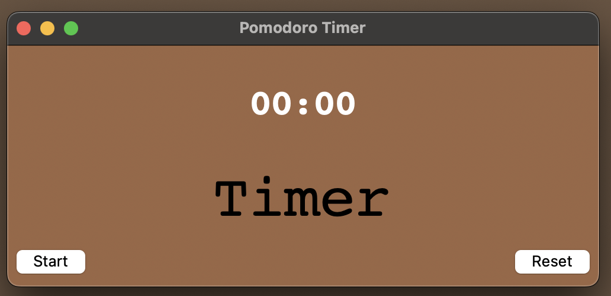

# pomodoro-timer

### Quick Overview

I always use a pomodoro timer when I'm studying so I thought it would be fun to create my own version. I created two versions, one using the Python OS interface, and one with Python Tkinter GUI.

Pomodoro Technique: 25-minute work sessions broken by five-minute breaks, repeats 4 through 4 work intervals, ends with a long break which is usually 15 minutes. Inspired by my favourite website [Tomato Timers](https://www.tomatotimers.com)

------------------------

### Files in this project:

* pomodorotimer.py:

This is the simple version of a pomodoro timer using the Python OS interface. User has to input an amount of time for their task, short break, and long break, respectively. The timer loops through using the Pomodoro technique.

* pomodoro-gui.py and gui-pics:

This is another simple version of a pomodoro timer using tkinter (first time using this library so my timer is not pretty lol). I added a start and reset button, when you start the timer, it will automatically go through the pomodoro cycle.

Some helpful links I used for making this:
* [Reference for GUI code](https://medium.com/nerd-for-tech/creating-a-pomodoro-gui-app-using-tkinter-in-python-d179e67e0ae0)
